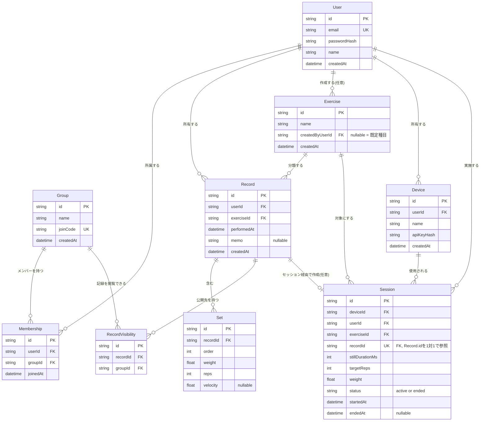

# データ仕様書

> このドキュメントは `backend/prisma/schema.prisma`（マイグレーション適用済み: `20260804113232_init`）を正とし、
> `docs/design.md` 3章・5-3のデータモデルを詳細化したもの。スキーマを変更した場合は、
> Prismaマイグレーション・`docs/design.md`・本ドキュメントの3点を必ず同時に更新する。

## 1. 概要

- DBMS: PostgreSQL 16
- ORM: Prisma
- 主キー: 全テーブル共通で `String @id @default(cuid())`（連番IDではなく衝突しにくい文字列ID）
- 日時型: `DateTime`（Prisma内部はUTC管理。表示時にクライアント側でタイムゾーン変換する想定）
- 論理削除は採用しない（削除は物理削除。`Set`・`RecordVisibility`は親`Record`削除時に`onDelete: Cascade`）

## 2. ER図

## 3. テーブル定義

### 3.1 User（ユーザー）

| カラム | 型 | 制約 | 説明 |
|---|---|---|---|
| id | String | PK, cuid | ユーザーID |
| email | String | UNIQUE, NOT NULL | ログインID。`class-validator`の`@IsEmail`で形式検証 |
| passwordHash | String | NOT NULL | bcrypt (SALT_ROUNDS=10) でハッシュ化。平文は保存しない |
| name | String | NOT NULL, 1〜50文字 | 表示名 |
| createdAt | DateTime | NOT NULL, default(now()) | 登録日時 |

**API応答で公開してよい項目**（`PublicUser`型）: `id`, `email`, `name`, `createdAt` のみ。`passwordHash`は外部に絶対に返さない（[auth.types.ts](../backend/src/auth/auth.types.ts)）。

### 3.2 Group（グループ）

| カラム | 型 | 制約 | 説明 |
|---|---|---|---|
| id | String | PK, cuid | グループID |
| name | String | NOT NULL | グループ名 |
| joinCode | String | UNIQUE, NOT NULL | 参加コード。これを知っていれば誰でも参加可能 |
| createdAt | DateTime | NOT NULL, default(now()) | 作成日時 |

作成者は作成と同時に`Membership`が1件自動生成される（design.md 5-2）。

### 3.3 Membership（所属）

| カラム | 型 | 制約 | 説明 |
|---|---|---|---|
| id | String | PK, cuid | |
| userId | String | FK → User.id, NOT NULL | |
| groupId | String | FK → Group.id, NOT NULL | |
| joinedAt | DateTime | NOT NULL, default(now()) | 参加日時 |

- 複合ユニーク制約: `(userId, groupId)` — 同じグループに二重参加できない
- インデックス: `groupId`（グループのメンバー一覧取得用）

### 3.4 Exercise（種目）

| カラム | 型 | 制約 | 説明 |
|---|---|---|---|
| id | String | PK, cuid | |
| name | String | NOT NULL | 種目名（例: ベンチプレス） |
| createdByUserId | String? | FK → User.id, NULL可 | `null`=既定種目（シード投入）。値あり=そのユーザーのカスタム種目 |
| createdAt | DateTime | NOT NULL, default(now()) | |

### 3.5 Record（記録）

| カラム | 型 | 制約 | 説明 |
|---|---|---|---|
| id | String | PK, cuid | |
| userId | String | FK → User.id, NOT NULL | 所有者。編集・削除は所有者のみ可能 |
| exerciseId | String | FK → Exercise.id, NOT NULL | |
| performedAt | DateTime | NOT NULL | 実施日 |
| memo | String? | NULL可 | 任意メモ |
| createdAt | DateTime | NOT NULL, default(now()) | |

- インデックス: `(userId, performedAt)`（自分の記録一覧を日付順に取るクエリ用）
- 1つの`Record`は複数の`Set`、複数の`RecordVisibility`（公開先グループ）、任意で1つの`Session`（デバイス経由作成時）を持つ

### 3.6 Set（セット）

| カラム | 型 | 制約 | 説明 |
|---|---|---|---|
| id | String | PK, cuid | |
| recordId | String | FK → Record.id, NOT NULL, `onDelete: Cascade` | 親記録削除時に連動削除 |
| order | Int | NOT NULL | セットの順番（1セット目、2セット目…） |
| weight | Float | NOT NULL | 重量(kg) |
| reps | Int | NOT NULL | 回数 |
| velocity | Float? | NULL可 | 挙上速度(m/s)。手入力では通常null、デバイス計測時に入る |

- インデックス: `recordId`

### 3.7 RecordVisibility（記録の公開範囲）

| カラム | 型 | 制約 | 説明 |
|---|---|---|---|
| id | String | PK, cuid | |
| recordId | String | FK → Record.id, NOT NULL, `onDelete: Cascade` | |
| groupId | String | FK → Group.id, NOT NULL | |

- 複合ユニーク制約: `(recordId, groupId)`
- インデックス: `groupId`
- **この表に行が1つも無い記録＝「自分だけ」に非公開**（design.md 3章）

### 3.8 Device（計測デバイス）

| カラム | 型 | 制約 | 説明 |
|---|---|---|---|
| id | String | PK, cuid | |
| userId | String | FK → User.id, NOT NULL | 所有者 |
| name | String | NOT NULL | デバイスの呼び名 |
| apiKeyHash | String | NOT NULL | APIキーはハッシュ化して保存。平文は登録時に一度だけレスポンスで返す |
| createdAt | DateTime | NOT NULL, default(now()) | |

- インデックス: `userId`

### 3.9 Session（デバイス使用セッション）

| カラム | 型 | 制約 | 説明 |
|---|---|---|---|
| id | String | PK, cuid | |
| deviceId | String | FK → Device.id, NOT NULL | |
| userId | String | FK → User.id, NOT NULL | セッション実施者（＝記録の所有者になる） |
| exerciseId | String | FK → Exercise.id, NOT NULL | |
| recordId | String | FK → Record.id, UNIQUE, NOT NULL | セッション開始時に生成される専用の空Record |
| stillDurationMs | Int | NOT NULL | 静止判定の閾値（ブザー鳴動条件） |
| targetReps | Int | NOT NULL | 目標レップ数 |
| weight | Float | NOT NULL | このセッションで扱う重量 |
| status | String | NOT NULL, default("active") | `active` \| `ended` |
| startedAt | DateTime | NOT NULL, default(now()) | |
| endedAt | DateTime? | NULL可 | セッション終了時に設定 |

- インデックス: `(deviceId, status)`（デバイスの現在activeなセッションを引く用）

## 4. 認可ロジックとデータの関係（重要）

ユーザー`U`が記録`R`を**閲覧**できる条件（design.md 3章、Service層で判定）:

1. `R.userId == U.id`（自分の記録）、または
2. `RecordVisibility`に`R.id`と、`U`が`Membership`で所属している`Group.id`の組が存在する

**編集・削除**は `R.userId == U.id` の場合のみ。この判定はController/フロントに依存せず、必ずService層に実装する（[.claude/rules/services.md](../.claude/rules/services.md)）。

## 5. 実装状況

| テーブル | マイグレーション | 対応API |
|---|---|---|
| User | 適用済み（`20260804113232_init`） | Auth実装済み（登録・ログイン・`/auth/me`） |
| Group / Membership | 適用済み | 未実装 |
| Exercise | 適用済み | 未実装 |
| Record / Set / RecordVisibility | 適用済み | 未実装 |
| Device / Session | 適用済み | 未実装（第2部） |

スキーマは初回マイグレーションで全テーブル一括作成済み。API実装は design.md 末尾の順序（Auth → Groups → Exercises → Records → Feed → Stats → Devices/Sessions）に従って段階的に進める。
